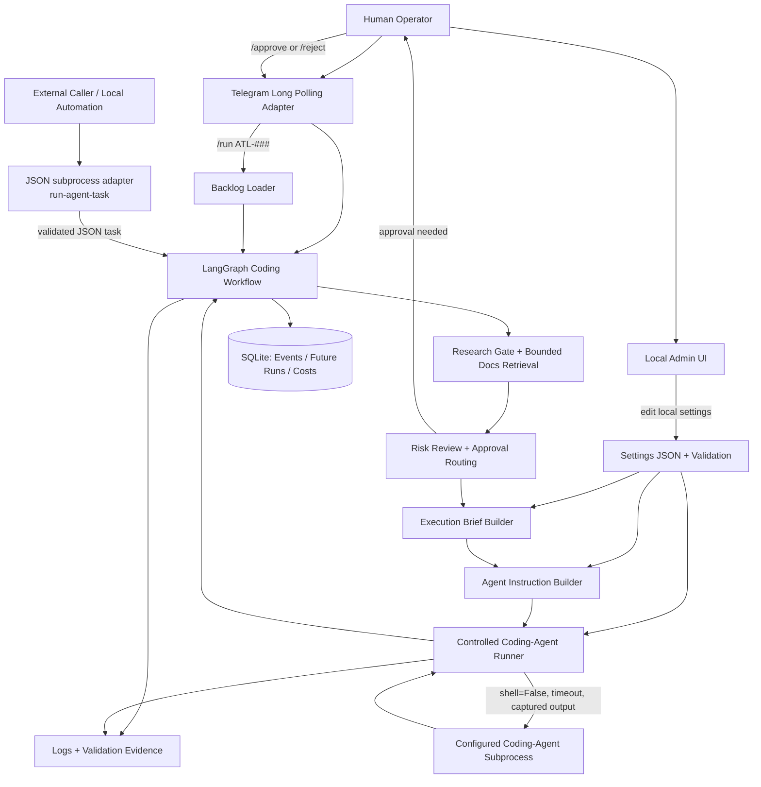

# Architecture

This project is a local AI technical lead orchestrator. The core product is not
the admin UI or Telegram surface; it is the workflow that turns an explicit
human request into a bounded coding-agent execution.

## Document split

Use this file for stable system boundaries: ownership, adapters, persistence,
contracts, and module responsibilities.

Use `GRAPH_WORKFLOW.md` for the node-by-node runtime path of the main coding
workflow graph.

## Design Diagram

This diagram is maintained as Mermaid text so it can evolve with the code. It is not a one-off drawing.



## Implemented Graphs

The codebase currently implements two LangGraph workflows:

1. `src/ai_tech_lead/coding_workflow_graph.py`
   - Exported Studio graph: `graph = build_graph()`
   - Purpose: turn an explicit human request into a bounded coding-agent execution. See `GRAPH_WORKFLOW.md` for the node-by-node route and interrupt/resume flow.
   - Main responsibilities: research gating, risk review, clarification handling, planning, approval routing, agent-instruction creation, and controlled coding-agent execution.
   - Studio registration: this is the only graph currently listed in `langgraph.json`.
   - Local PNG export: [graph_diagram.png](diagrams/graph_diagram.png)

2. `src/ai_tech_lead/telegram_agent_graph.py`
   - Exported entrypoint: `build_telegram_agent_graph(...)`
   - Purpose: provide a read-only Telegram agent for backlog Q&A and safe tool use.
   - Main responsibilities: chat-thread message handling, tool binding, backlog read-only tools, and reply generation.
   - Studio registration: not exported in `langgraph.json`; it is used by the Telegram operator at runtime.
   - No standalone PNG export: the compiled graph is only the tiny assistant/tools loop, which is accurate but not useful as a Telegram runtime workflow diagram.

The helper `src/ai_tech_lead/graph_diagrams.py` refreshes the main coding workflow PNG in `docs/diagrams/` so the implemented runtime path stays visible without needing to hunt for the rendering code.

Supporting modules such as `src/ai_tech_lead/backlog_graph_runner.py` call the coding workflow graph builder, but they are runners/adapters rather than separate graph implementations.

## Boundaries

- Input adapters turn external messages into explicit local tasks.
  Current adapters: Telegram long polling, the local admin UI, and the JSON subprocess.
  The CLI starts the process, but it does not select backlog tasks.
  Telegram is the human-facing bot for AI Tech Lead: use it directly when you want to talk to the coding agent from chat.
  It must call the bounded workflow and must not become a second agent brain.
  The JSON subprocess enters through `run-agent-task`, which validates the JSON contract before handing the task to the graph.
  Caller-supplied project/context data is normalized there into AI Tech Lead's own immutable internal `TargetProjectContext` before any graph node, planner, or coding-agent step uses it.
  An external caller may own caller-side orchestration, paused-run bookkeeping, and resume or approval UX.
  AI Tech Lead owns the specialist-internal graph, prompts, approvals, and the mapping from internal pauses to the subprocess status contract.
  Future adapters may include web or other chat surfaces.
- Google Sheets is the only canonical backlog. `SheetsBacklogRepository` (`backlog_sheets_repository.py`) is the live repository boundary — Telegram, chat tools, and the Agent Hub subprocess path all read/write through it. `MarkdownBacklogRepository` remains for the historical archive format only and is not constructed by any live call site.
- `data/backlog.sqlite3` holds runtime state only, not backlog ownership: task snapshots (the exact source row and its hash at fetch time), a pending-update outbox for Sheet writes, and sync-conflict records (`backlog_runtime_store.py`). It exposes no create/edit/list/planning operations.
- Every backlog-driven run follows one flow: fetch the exact Sheet row by `BacklogReference` (`backlog_reference.py` — project key, spreadsheet ID, sheet name, item ID; never hardcoded), snapshot it, execute, then write-ahead the completion update to the outbox and attempt an immediate flush. If the source row changed since the snapshot, the update is abandoned and a conflict is recorded instead of overwriting a human edit. If the Sheets call fails, the row stays pending for bounded recovery (`backlog-sync-recover` CLI command, also run automatically at Telegram-operator startup) — retries are bounded per row, never infinite, and a row is never silently reported as synced.
- Only the `Status` and `Evidence / Validation` columns are ever written by runtime code.
- Backlog loading parses the fetched item into graph state. It must not silently choose work.
- Worker coding agents must not freely edit backlog storage. Any backlog edit must be explicitly requested, field-bounded, and owned by the human/orchestrator through a controlled repository boundary.
- The coding workflow graph owns orchestration state, approval routing, brief creation, agent-instruction creation, orchestrator-input request state, and the coding-agent execution node.
- Coding-agent handoffs now have three explicit instruction layers:
  1. AI Tech Lead runtime core, which is reusable across projects.
  2. Reusable runtime skills that travel with the AI Tech Lead runtime.
  3. Target-project rules and target-project skills loaded from the selected `project_root`.
- Tech Lead Analysis reads layer 3's same project-pack files (`AGENTS.md`, `docs/INDEX.md`, `.skills/INDEX.md`) earlier and more loosely than the coding-agent handoff does: bounded, read-only, and optional (`project_guidance_discovery.py`) — a missing file is never an error there, unlike the hard-required extraction `instruction_assembler.py` performs once a coding-agent handoff is actually being built.
- Graph state keeps any conditional orchestrator-input metadata bounded and explicit; see `CONTEXT_MANAGEMENT.md` for the field shape.
- Project-aware steps must read the same validated internal target-project context for research code scans, planning, approval Q&A, coding-agent execution, changed-file checks, completion verification, and backlog attribution rather than independently guessing or defaulting a repo.
- The current coding-agent backend is Codex CLI, but the architecture must stay
  backend-neutral. Future backends may include Claude Code, OpenAI tools, local
  agents, or other compatible execution backends.
- Settings own configurable values, limits, paths, model names, and prices.
  Human-readable prompt and rule text lives in `data/prompts.json`. Prompt
  keys are centralized in `src/ai_tech_lead/prompt_loader.py`, and graph nodes
  or instruction builders load the registry entries on demand when they need
  them. The local admin UI exposes the same registry so prompts can be
  inspected and edited in one obvious place. Research source indexes, approved
  online docs URLs, and fetch limits are also settings-owned so the research
  gate stays bounded and configurable.
- The coding-agent runner owns subprocess execution. It receives a complete
  instruction, project root, and validated settings, then captures stdout and
  stderr without using `shell=True`.
- External callers should call `uv run python -m ai_tech_lead manifest`, cache the
  returned JSON by `manifest_hash`, and refresh only when the hash changes. If the
  manifest includes `manifest_cache_ttl_seconds`, callers may use that as the
  freshness window for re-fetching the full manifest.
- `run-agent-task` uses the same durable, SQLite-backed LangGraph checkpointer the
  Telegram operator uses (`checkpointer_store.py`), keyed by `subprocess-<request_id>`.
  A paused conversation survives across separate subprocess invocations, so a caller
  resumes the exact paused run rather than restarting the task from scratch.
- LangChain/LangGraph tools, when added, are executable capabilities exposed to an LLM or graph. They are different from this repository's `.skills`, which are reusable coding-agent instructions.
- Admin UI is optional local tooling for editing settings. Browser code keeps HTML, CSS, and JavaScript separated. HTML owns structure, CSS owns presentation, and JavaScript owns behaviour. Browser JavaScript uses ES modules.
- UI field schemas, API paths, labels, and other UI configuration should move to JSON or API-provided configuration when they become shared, large, or reused. Small local constants are acceptable only when they are explicit and easy to replace.
- Placeholder/demo adapters should be removed once a real adapter replaces them, unless the human explicitly wants to keep them for teaching or tests.

## JSON Subprocess Contract

This section replaces the standalone `ARMY_INTEGRATION.md` page. Keep the bounded subprocess contract here so the non-interactive caller boundary has one canonical home.

- A caller invokes AI Tech Lead through `run-agent-task`.
- A caller discovers the callable contract through `uv run python -m ai_tech_lead manifest`.
- A new task is JSON with a task string plus bounded metadata such as `request_id`, optional Hub `run_id`, `source`, explicit `project_root`, `project_reference`, optional `task_kind`, `references`, and `execution_mode`.
- `run-agent-task` accepts generic caller project/context data, validates it once, and converts it into AI Tech Lead's internal immutable `TargetProjectContext`. A supplied target project root must match the authorised `project_registry` or arrive with explicit human approval for that task. Project-aware steps fail clearly instead of silently substituting AI Tech Lead's own repo, and they stop safely when the registered platform, credentials, or location are unavailable.
- `task_kind` defaults to `coding_task`. `task_kind: "backlog_refinement"` routes through the existing backlog-refinement service instead of the coding workflow and is the primary Hub entrypoint for proposing new backlog items.
- Backlog refinement reads project-specific backlog settings from the supplied target-project context (`project_reference.backlog` / `project_reference.backlog_project`) rather than from hardcoded Sheet IDs, tabs, prefixes, columns, or repo-local aliases. Telegram `/propose` reuses the same underlying capability.
- `execution_mode` is a request, not a grant. `instruction_only` is the safe default.
- A paused conversation is resumed by resubmitting the same `request_id` with a `decision: {"option": ..., "text": ..., "actor": ...}` object — no `task` field needed. The option must be one of the names the paused response's `pending_decision.options` just reported; anything else is rejected.
- Output is structured JSON with status, summary, formulated task, brief, coding-agent instruction, backend used, execution flag, logs, evidence, next action, a `pending_decision` block describing exactly what's paused and what decisions are valid right now, and a tiny `agent_manifest` reference.
- When a caller supplies `run_id`, AI Tech Lead also emits versioned `SpecialistProgressEvent` JSONL on stdout while it runs. Normal/debug logs stay on stderr, and the final structured result remains in the caller-provided output JSON file.
- Progress events contain `schema_version`, `run_id`, `request_id`, monotonic `sequence`, `event_type`, stable `phase`, bounded `human_summary`, `occurred_at`, and allowlisted bounded metadata.
- Progress is operational telemetry only. It must not expose chain-of-thought, raw plan text, full prompts, secrets, raw coding-agent/provider output, or unbounded logs.
- Existing LangGraph/coding-runner callbacks are translated into stable external phases. Future Deep Agent custom/task events must pass through the same translation boundary instead of leaking framework-specific events to Hub.
- Deterministic specialist heartbeats may be emitted after a genuinely quiet interval without additional LLM calls. Hub remains responsible for persistence, stale detection, Telegram rate limiting, and operator-facing message updates.
- If `run_id` is omitted, live progress is disabled and stdout remains unused by this contract.
- Supported subprocess statuses are:
  - `success` - work completed or an instruction package is ready.
  - `needs_clarification` - the workflow ended (not paused) needing more information, e.g. an unresolved reference. There is no conversation to resume; the caller should submit a brand new task with the answer folded in.
  - `waiting_decision` - the workflow is genuinely paused (approval, plan/failure guidance, research approval, backlog-refinement approval). See `pending_decision` for the exact options; resume by resubmitting `request_id` with a `decision`.
  - `failed` - terminal failure; the caller should report the error instead of waiting for resume.
- Callers should prefer machine-readable fields over parsing prose:
  - `result_kind` distinguishes `instruction_package`, `execution_result`, `backlog_refinement_draft`, `backlog_item_created`, `clarification_request`, `decision_required`, and `terminal_failure`.
  - `pending_decision` (present only on `waiting_decision`) carries `thread_id` (informational), `kind` (which internal pause this is — relay it, don't interpret it), `prompt` (plain-language description), and `options` (the exact, only valid `decision.option` values right now, each optionally flagged `needs_text`). This is intentionally generic: a caller never needs agent-specific knowledge of what option names mean to relay them correctly, and new pause kinds or option sets require no caller code changes.
- A caller should rely on that bounded JSON contract rather than reading the full codebase.
- Telegram is only an interactive operator surface; it does not replace the subprocess contract.
- Shared-state concurrency rules:
  - duplicate concurrent `run-agent-task` calls with the same `request_id` fail loudly
    instead of overlapping silently
  - real coding-agent subprocess execution is locked per `project_root`, so two runs
    cannot execute against the same repo at once even if the caller misroutes work

## Persistence

SQLite is the preferred local persistence layer when the project needs durable task runs, approvals, events, cost/token usage, or operator audit history. Keep SQLite minimal until those tables are genuinely used.

Do not add database tables only because a future feature might need them. Add a table when a workflow reads from it, writes to it, or reports from it.

## Test Strategy

Use `pytest` as the default test runner for the core product:

```bash
uv run pytest
```

The default suite should stay fast and should not call real coding agents. Mock
subprocess behavior in unit tests, and validate real coding-agent execution only through
explicit CLI runs.

Playwright belongs in a later browser/E2E layer when the admin UI or a web input
surface becomes important enough to protect.

## Current Telegram Operating Model

Telegram is the human-facing bot for AI Tech Lead and the normal way to talk
to the coding agent from a phone. Normal text goes through a Telegram intent
router first; the router may classify the message, but it must not execute the
configured coding agent or mutate the backlog by itself. Explicit `/run ATL-###`
selects a backlog task. Explicit `/code` starts the bounded coding workflow.

Current Telegram constraints:

- Long polling only; no webhooks yet.
- Single active task only.
- Single owning chat per running process.
- No autonomous task selection.
- Approval still gates progression; Telegram must not bypass the graph approval path.

Telegram enable/disable and coding-agent execution enable/disable must be controlled by settings/admin, not by requiring the human to remember CLI flag combinations. Normal app startup should read settings and start the configured operator surfaces. CLI flags are acceptable only for local development, diagnostics, or explicit debug paths such as `--debug`; they must not become the normal way to enable production behaviour.

These are acceptable MVP constraints because they keep the workflow inspectable and reduce concurrency, security, and deployment complexity. Revisit them only when the single-user operator loop is proven useful.

## Growth Rule

Prototype scope means small, not disposable. Add narrow modules around durable
boundaries instead of mixing adapters, graph logic, settings, subprocess calls,
and UI behavior in the same file.

When a prototype file is superseded by a real implementation, either remove it
or clearly document why it still exists. Do not let old placeholders become
silent dead code.
