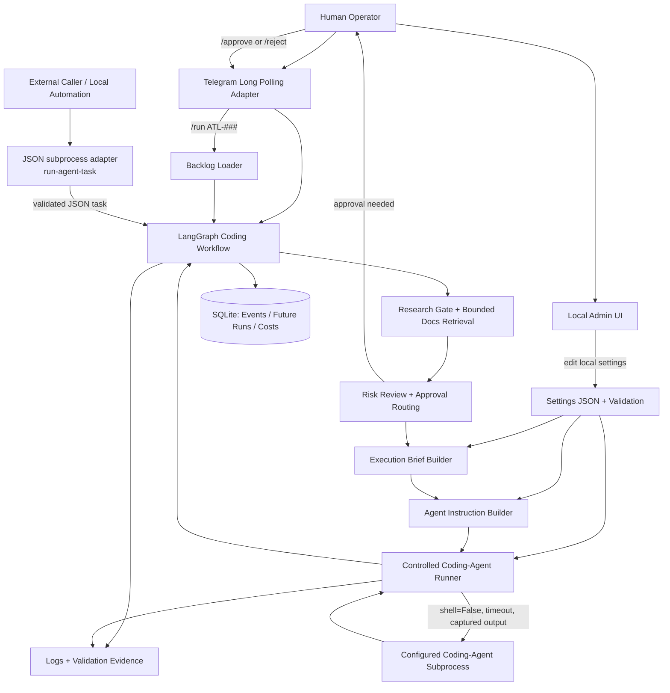

# Architecture

This project is a local AI technical lead orchestrator. The core product is not
the admin UI or Telegram surface; it is the workflow that turns an explicit
human request into a bounded coding-agent execution.

## Document split

Use this file for stable system boundaries: ownership, adapters, persistence,
contracts, and module responsibilities.

Use `GRAPH_WORKFLOW.md` for the node-by-node runtime path of the main coding
workflow graph.

## Design Diagram

This diagram is maintained as Mermaid text so it can evolve with the code. It is not a one-off drawing.



## Implemented Graphs

The codebase currently implements two LangGraph workflows:

1. `src/ai_tech_lead/coding_workflow_graph.py`
   - Exported Studio graph: `graph = build_graph()`
   - Purpose: turn an explicit human request into a bounded coding-agent execution. See `GRAPH_WORKFLOW.md` for the node-by-node route and interrupt/resume flow.
   - Main responsibilities: research gating, risk review, clarification handling, planning, approval routing, agent-instruction creation, and controlled coding-agent execution.
   - Studio registration: this is the only graph currently listed in `langgraph.json`.
   - Local PNG export: [graph_diagram.png](diagrams/graph_diagram.png)

2. `src/ai_tech_lead/telegram_agent_graph.py`
   - Exported entrypoint: `build_telegram_agent_graph(...)`
   - Purpose: provide a read-only Telegram agent for backlog Q&A and safe tool use.
   - Main responsibilities: chat-thread message handling, tool binding, backlog read-only tools, and reply generation.
   - Studio registration: not exported in `langgraph.json`; it is used by the Telegram operator at runtime.
   - Local PNG export: [telegram_agent_graph.png](diagrams/telegram_agent_graph.png)

The helper `src/ai_tech_lead/graph_diagrams.py` refreshes both PNGs in `docs/diagrams/` so the diagrams stay visible without needing to hunt for the rendering code.

Supporting modules such as `src/ai_tech_lead/backlog_graph_runner.py` call the coding workflow graph builder, but they are runners/adapters rather than separate graph implementations.

## Boundaries

- Input adapters turn external messages into explicit local tasks.
  Current adapters: Telegram long polling, the local admin UI, and the JSON subprocess.
  The CLI starts the process, but it does not select backlog tasks.
  Telegram is the human-facing bot for AI Tech Lead: use it directly when you want to talk to the coding agent from chat.
  It must call the bounded workflow and must not become a second agent brain.
  The JSON subprocess enters through `run-agent-task`, which validates the JSON contract before handing the task to the graph.
  An external caller may own caller-side orchestration, paused-run bookkeeping, and resume or approval UX.
  AI Tech Lead owns the specialist-internal graph, prompts, approvals, and the mapping from internal pauses to the subprocess status contract.
  Future adapters may include web or other chat surfaces.
- Backlog storage must stay behind a repository boundary. The current runtime backlog is `data/backlog.sqlite3`; the Excel workbook `data/backlog/ai_tech_lead_backlog.xlsx` is the human-review/planning workbook; the archived Markdown source/backup lives at `data/backlog/archive/BACKLOG.md`.
- Backlog loading parses local task data and converts one selected item into
  graph state. It must not silently choose work.
- Worker coding agents must not freely edit the Excel backlog. Any backlog edit must be explicitly requested, field-bounded, and owned by the human/orchestrator until a controlled backlog repository handles spreadsheet writes safely.
- The coding workflow graph owns orchestration state, approval routing, brief creation, agent-instruction creation, orchestrator-input request state, and the coding-agent execution node.
- Graph state keeps any conditional orchestrator-input metadata bounded and explicit; see `CONTEXT_MANAGEMENT.md` for the field shape.
- The current coding-agent backend is Codex CLI, but the architecture must stay
  backend-neutral. Future backends may include Claude Code, OpenAI tools, local
  agents, or other compatible execution backends.
- Settings own configurable values, limits, paths, model names, and prices.
  Human-readable prompt and rule text lives in `data/prompts.json`. Prompt
  keys are centralized in `src/ai_tech_lead/prompt_loader.py`, and graph nodes
  or instruction builders load the registry entries on demand when they need
  them. The local admin UI exposes the same registry so prompts can be
  inspected and edited in one obvious place. Research source indexes, approved
  online docs URLs, and fetch limits are also settings-owned so the research
  gate stays bounded and configurable.
- The coding-agent runner owns subprocess execution. It receives a complete
  instruction, project root, and validated settings, then captures stdout and
  stderr without using `shell=True`.
- External callers should call `uv run python -m ai_tech_lead manifest`, cache the
  returned JSON by `manifest_hash`, and refresh only when the hash changes.
- LangChain/LangGraph tools, when added, are executable capabilities exposed to an LLM or graph. They are different from this repository's `.skills`, which are reusable coding-agent instructions.
- Admin UI is optional local tooling for editing settings. Browser code keeps HTML, CSS, and JavaScript separated. HTML owns structure, CSS owns presentation, and JavaScript owns behaviour. Browser JavaScript uses ES modules.
- UI field schemas, API paths, labels, and other UI configuration should move to JSON or API-provided configuration when they become shared, large, or reused. Small local constants are acceptable only when they are explicit and easy to replace.
- Placeholder/demo adapters should be removed once a real adapter replaces them, unless the human explicitly wants to keep them for teaching or tests.

## JSON Subprocess Contract

This section replaces the standalone `ARMY_INTEGRATION.md` page. Keep the bounded subprocess contract here so the non-interactive caller boundary has one canonical home.

- A caller invokes AI Tech Lead through `run-agent-task`.
- Input is JSON with a task string plus bounded metadata such as `request_id`, `source`, `project_root`, `execution_mode`, `human_approved`, and `approval_token`.
- `execution_mode` is a request, not a grant. `instruction_only` is the safe default.
- `human_approved=true` must carry a matching one-time token issued for the same request and task.
- Output is structured JSON with status, summary, formulated task, brief, coding-agent instruction, backend used, execution flag, logs, evidence, next action, and a tiny `agent_manifest` reference.
- Supported subprocess statuses are:
  - `success` - work completed or an instruction package is ready.
  - `needs_clarification` - the caller should collect human text input and resubmit an updated task.
  - `approval_required` - the caller should collect explicit approval and resubmit with `human_approved=true` plus the issued `approval_token`.
  - `failed` - terminal failure; the caller should report the error instead of waiting for resume.
- Specialist-internal interrupts that expect human text, such as plan guidance or repeated coding-agent failure guidance, must be translated into `needs_clarification` on this subprocess boundary instead of leaking a generic paused or blocked state.
- A caller should rely on that bounded JSON contract rather than reading the full codebase.
- Telegram is only an interactive operator surface; it does not replace the subprocess contract.

## Persistence

SQLite is the preferred local persistence layer when the project needs durable task runs, approvals, events, cost/token usage, or operator audit history. Keep SQLite minimal until those tables are genuinely used.

Do not add database tables only because a future feature might need them. Add a table when a workflow reads from it, writes to it, or reports from it.

## Test Strategy

Use `pytest` as the default test runner for the core product:

```bash
uv run pytest
```

The default suite should stay fast and should not call real coding agents. Mock
subprocess behavior in unit tests, and validate real coding-agent execution only through
explicit CLI runs.

Playwright belongs in a later browser/E2E layer when the admin UI or a web input
surface becomes important enough to protect.

## Current Telegram Operating Model

Telegram is the human-facing bot for AI Tech Lead and the normal way to talk
to the coding agent from a phone. Normal text goes through a Telegram intent
router first; the router may classify the message, but it must not execute the
configured coding agent or mutate the backlog by itself. Explicit `/run ATL-###`
selects a backlog task. Explicit `/code` starts the bounded coding workflow.

Current Telegram constraints:

- Long polling only; no webhooks yet.
- Single active task only.
- Single owning chat per running process.
- No autonomous task selection.
- Approval still gates progression; Telegram must not bypass the graph approval path.

Telegram enable/disable and coding-agent execution enable/disable must be controlled by settings/admin, not by requiring the human to remember CLI flag combinations. Normal app startup should read settings and start the configured operator surfaces. CLI flags are acceptable only for local development, diagnostics, or explicit debug paths such as `--debug`; they must not become the normal way to enable production behaviour.

These are acceptable MVP constraints because they keep the workflow inspectable and reduce concurrency, security, and deployment complexity. Revisit them only when the single-user operator loop is proven useful.

## Growth Rule

Prototype scope means small, not disposable. Add narrow modules around durable
boundaries instead of mixing adapters, graph logic, settings, subprocess calls,
and UI behavior in the same file.

When a prototype file is superseded by a real implementation, either remove it
or clearly document why it still exists. Do not let old placeholders become
silent dead code.
