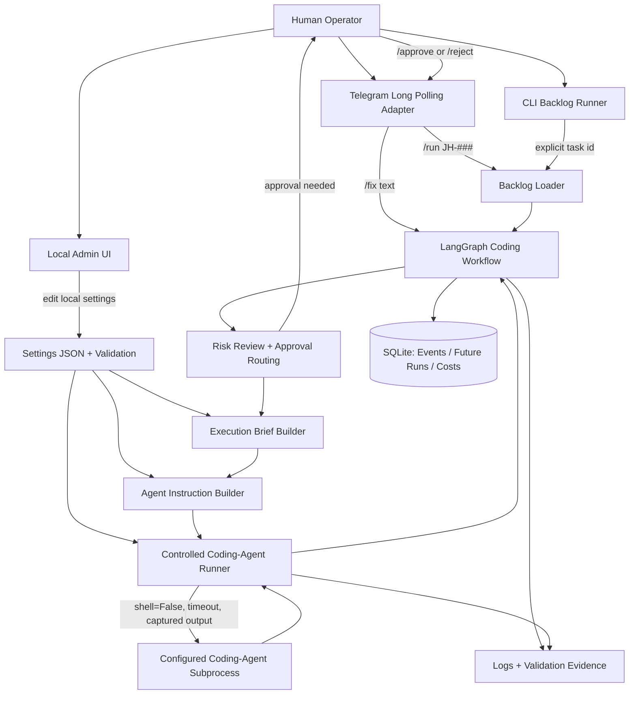

# Architecture

This project is a local AI technical lead orchestrator. The core product is not
the admin UI or Telegram surface; it is the workflow that turns an explicit
human request into a bounded coding-agent execution.

## Design Diagram

This diagram is maintained as Mermaid text so it can evolve with the code. It is not a one-off drawing.



## Boundaries

- Input adapters turn external messages into explicit local tasks.
  Current adapters: CLI backlog task selection and Telegram long polling.
  Telegram is an operator surface only; it must call the bounded workflow and must not become a second agent brain.
  Future adapters may include web or other chat surfaces.
- Backlog storage is accessed through a repository boundary. The current implementation is Markdown-backed, with explicit list, get, next ID, add, and validation operations. A future Google Sheets implementation should preserve this boundary instead of changing Telegram or graph code.
- Backlog loading parses local task data and converts one selected item into
  graph state. It must not silently choose work.
- The coding workflow graph owns orchestration state, approval routing, brief
  creation, agent-instruction creation, and the coding-agent execution node.
- Settings own configurable values, limits, paths, model names, and prices.
  Human-readable prompt and rule text lives in `docs/prompts/` and is loaded by
  graph nodes or instruction builders when they need it. Admin viewing/editing
  can be added later without changing that ownership boundary.
- The coding-agent runner owns subprocess execution. It receives a complete
  instruction, project root, and validated settings, then captures stdout and
  stderr without using `shell=True`.
- LangChain/LangGraph tools, when added, are executable capabilities exposed to an LLM or graph. They are different from this repository's `.skills`, which are reusable coding-agent instructions.
- Admin UI is optional local tooling for editing settings. Browser code keeps HTML, CSS, and JavaScript separated. HTML owns structure, CSS owns presentation, and JavaScript owns behaviour. Browser JavaScript uses ES modules.
- UI field schemas, API paths, labels, and other UI configuration should move to JSON or API-provided configuration when they become shared, large, or reused. Small local constants are acceptable only when they are explicit and easy to replace.
- Placeholder/demo adapters should be removed once a real adapter replaces them, unless the human explicitly wants to keep them for teaching or tests.

## Persistence

SQLite is the preferred local persistence layer when the project needs durable task runs, approvals, events, cost/token usage, or operator audit history. Keep SQLite minimal until those tables are genuinely used.

Do not add database tables only because a future feature might need them. Add a table when a workflow reads from it, writes to it, or reports from it.

## Test Strategy

Use `pytest` as the default test runner for the core product:

```bash
uv run pytest
```

The default suite should stay fast and should not call real coding agents. Mock
subprocess behavior in unit tests, and validate real coding-agent execution only through
explicit CLI runs.

Playwright belongs in a later browser/E2E layer when the admin UI or a web input
surface becomes important enough to protect.

## Current Telegram Operating Model

Telegram is the primary operator channel for the prototype. It should be the normal way to communicate with the app when the human is away from the PC.

Normal text goes through a Telegram intent router first. The router may classify the message as a question, backlog proposal, code task, status/help request, or unclear intent, but it must not execute the configured coding agent or mutate the backlog by itself. Explicit `/code` starts the bounded coding workflow; `/fix` remains only as an old alias for `/code`.

Current Telegram constraints:

- Long polling only; no webhooks yet.
- Single active task only.
- Single owning chat per running process.
- No autonomous task selection.
- Approval still gates progression; Telegram must not bypass the graph approval path.

Telegram enable/disable and coding-agent execution enable/disable must be controlled by settings/admin, not by requiring the human to remember CLI flag combinations. Normal app startup should read settings and start the configured operator surfaces. CLI flags are acceptable only for local development, diagnostics, or explicit debug paths such as `--debug`; they must not become the normal way to enable production behaviour.

These are acceptable MVP constraints because they keep the workflow inspectable and reduce concurrency, security, and deployment complexity. Revisit them only when the single-user operator loop is proven useful.

## Growth Rule

Prototype scope means small, not disposable. Add narrow modules around durable
boundaries instead of mixing adapters, graph logic, settings, subprocess calls,
and UI behavior in the same file.

When a prototype file is superseded by a real implementation, either remove it
or clearly document why it still exists. Do not let old placeholders become
silent legacy code.
