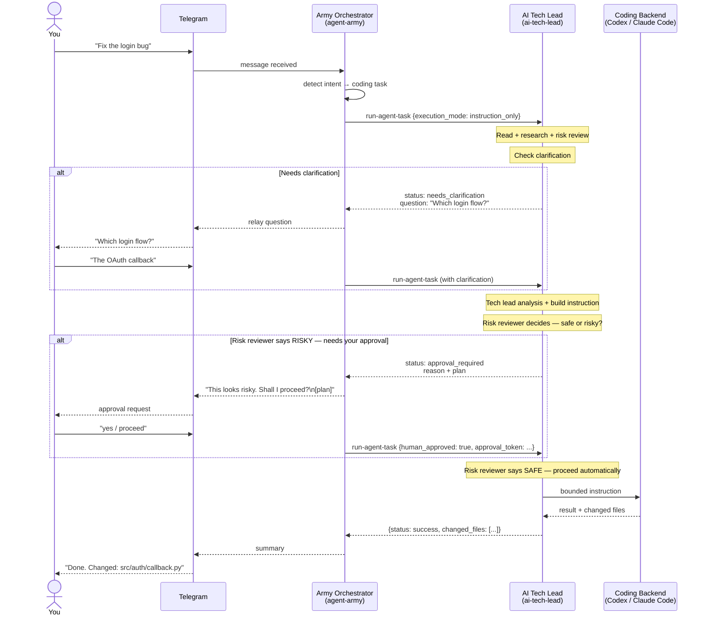
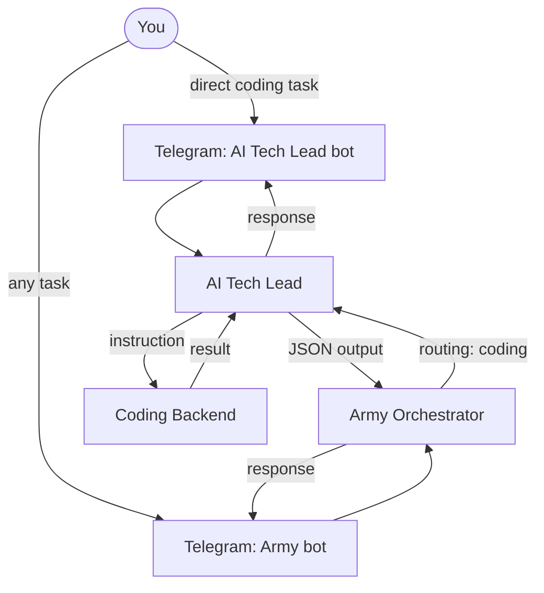

# Army Integration — AI Tech Lead as Coding Specialist

AI Tech Lead is a specialist agent in the Agent Army. The army orchestrator routes coding
requests to it via a JSON subprocess contract. Telegram is for humans only.

## How a coding task flows



## Army integration contract

### Input (army → ai-tech-lead)

```json
{
  "request_id": "army-generated-uuid",
  "source": "agent-army",
  "project_root": "/mnt/e/programming/job-hunter-agent",
  "task": "Fix the OAuth callback login bug",
  "execution_mode": "instruction_only",
  "requires_human_approval": true
}
```

`execution_mode` is a request, not a grant. Use `execute` only when the army explicitly wants
coding-agent execution and local settings allow it. `human_approved=true` must be paired with the
matching approval token for the same `request_id` and task.

### Output (ai-tech-lead → army)

```json
{
  "request_id": "army-generated-uuid",
  "status": "success | needs_clarification | approval_required | blocked | failed",
  "summary": "Instruction generated. Ready for coding agent execution.",
  "formulated_task": "Bounded task statement",
  "brief": "Technical direction from tech lead analysis",
  "coding_agent_instruction": "Full instruction for the coding backend",
  "backend_used": "none | codex | claude_code | gemini",
  "execution_performed": false,
  "logs": [],
  "evidence": ["LangChain OAuth docs"],
  "next_action": "Submit instruction to coding backend."
}
```

## Standalone mode

AI Tech Lead still works independently via its own Telegram bot. The army integration is
an additional entry point — it does not replace the existing Telegram flow.


